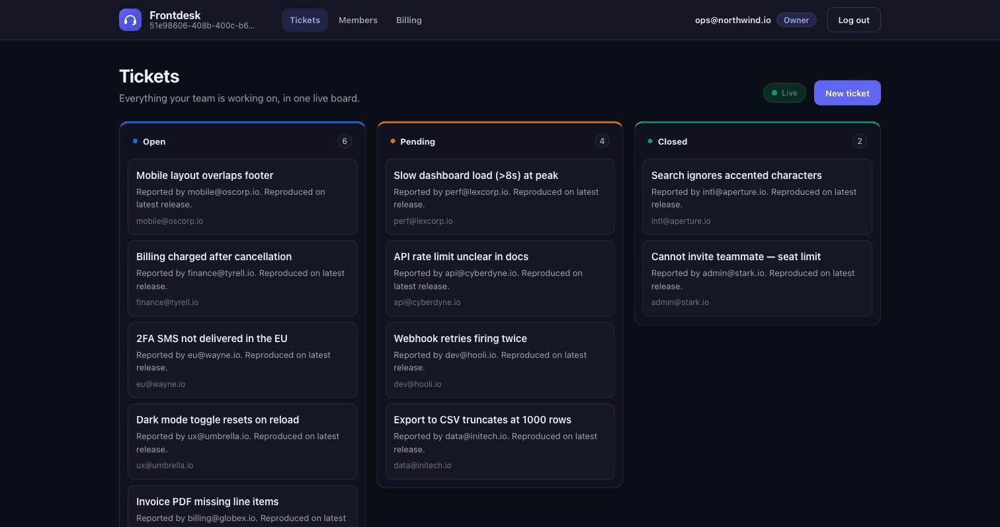
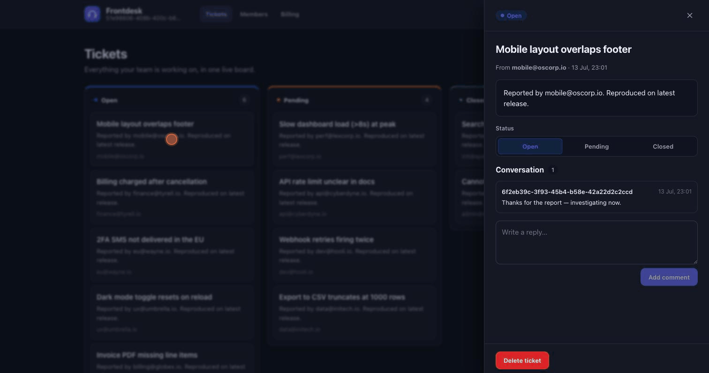
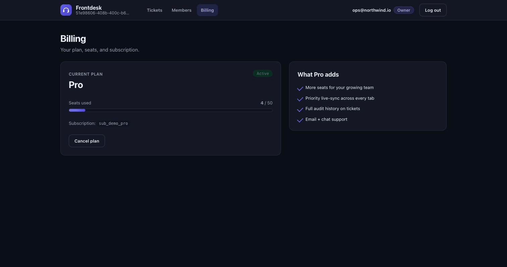

# frontdesk

**A multi-tenant support desk SaaS - teams, roles, live tickets, and Stripe billing - that runs end to end on your laptop with no cloud account and no real Stripe keys.**

Sign an organisation up, invite teammates with roles, and work a shared ticket queue that updates **live across tabs** over WebSockets. Billing is a real Stripe subscription flow, exercised locally against [stripe-mock](https://github.com/stripe/stripe-mock). One "docker compose up" brings the whole thing online: Postgres, stripe-mock, an async FastAPI backend, and a React frontend.


---

## Why it's more than a CRUD demo

Three things a real B2B SaaS has to get right, done here on purpose:

- **Tenant isolation is enforced centrally, not per-endpoint.** Every tenant-owned row carries an "org_id", and all reads go through one "scoped()" / "get_scoped()" helper ([tenancy.py](backend/src/frontdesk/tenancy.py)) that filters by the caller's org. Cross-org fetches return **404, never revealing existence**. There is a test that proves org A cannot read, modify, or delete org B's tickets or comments.
- **RBAC is one explicit matrix**, not scattered "if role ==" checks. Roles "owner" / "agent" / "viewer" map to permissions in a single table ([rbac.py](backend/src/frontdesk/rbac.py)); every protected route depends on "require(Permission.X)". Each role is tested against what it may and may not do.
- **Billing is real, and reconciling.** Upgrading creates a Stripe customer + subscription (via stripe-mock in test mode), and a webhook flips the stored plan/status from Stripe events. Seat limits are enforced on invite (Free caps at 3; a 4th invite returns 402).

No fabricated numbers: every figure below comes from the test suite or the committed [seed.py](backend/scripts/seed.py).

## Architecture

```
   Browser - tab A -                               +-- WebSocket /ws?token=...  (live events)
                   |        +--------------------+ |
   Browser - tab B +--HTTP-->  FastAPI backend   +-+   in-process per-org fan-out
                   |  +WS    |  (async SQLAlchemy)|
                   +-------->|                    +---- asyncpg --> +------------+
                             |  auth * tenancy *  |                 | PostgreSQL |
                             |  RBAC * tickets *  |                 +------------+
                             |  members * billing |
                             +---------+----------+
                                       | Stripe SDK (test mode)
                                       v
                             +-----------------+
                             |   stripe-mock   |   local Stripe API emulator
                             +-----------------+
```

The frontend is a Vite + React + TypeScript SPA (served by nginx in the container). It talks only to the backend; on the ticket board it holds a WebSocket open and patches the board the instant a "ticket.created" / "ticket.updated" / "comment.created" event arrives for the org - open two tabs and watch them stay in sync.

## Quickstart

```bash
docker compose up --build          # Postgres + stripe-mock + backend + frontend

# then, in another shell, load a realistic demo org:
docker compose exec backend uv run python -m scripts.seed
```

- Frontend -> http://localhost:5173  (log in as "ops@northwind.io" / "password123")
- Backend API + docs -> http://localhost:8000/docs

The "seed" command is idempotent and prints exactly what it created:

```
Seeded 'Northwind Support':
  members    4      tickets    12      comments   12
  open       6      pending    4       closed     2
```

### Screenshots

| Live ticket board | Ticket drawer | Billing (Pro) |
|---|---|---|
|  |  |  |

## Local dev (without Docker)

Needs a local Postgres and [uv](https://docs.astral.sh/uv/). stripe-mock via "docker run -p 12111:12111 stripe/stripe-mock".

```bash
# backend
cd backend && uv sync
uv run uvicorn frontdesk.main:app --reload      # :8000

# frontend
cd frontend && npm install
VITE_API_BASE=http://localhost:8000 npm run dev # :5173
```

Database schema is managed with **Alembic** ("uv run alembic upgrade head"); the app also "create_all"s on startup for zero-config dev.

## Tests

```bash
make test        # backend: 21 tests on a real Postgres + stripe-mock
make lint        # ruff + ruff format --check + mypy (strict)
cd frontend && npm run test   # 17 component/unit tests (vitest + jsdom)
```

**Backend - 21 tests, real Postgres (no mocks for the DB):**
- **Tenant isolation** - org A cannot list/read/modify/delete org B's tickets, comments, or members ([test_tenancy.py](backend/tests/test_tenancy.py)).
- **RBAC per role** - owner/agent/viewer each verified against create / delete / invite, plus "can't demote the last owner" ([test_rbac.py](backend/tests/test_rbac.py)).
- **Billing** - Free seat limit returns 402 on the 4th member; the webhook drives "active -> pro" and "deleted -> free"; a live **stripe-mock integration test** actually creates a customer + subscription through the Stripe SDK ([test_billing.py](backend/tests/test_billing.py), [test_stripe_mock.py](backend/tests/test_stripe_mock.py)).
- **WebSocket fan-out** - events reach an org's sockets only, dead sockets are pruned, and creating a ticket triggers a broadcast ([test_events.py](backend/tests/test_events.py)).

**Frontend - 17 tests:** the API client attaches the Bearer token, the auth context persists the session, the ticket board renders columns and reacts to a simulated "ticket.created" event, and viewer-role gating hides create/delete controls.

## Tech

| Layer | Choices |
|---|---|
| Backend | FastAPI * SQLAlchemy 2.0 async * asyncpg * Alembic * Pydantic v2 * python-jose (JWT) * passlib/bcrypt |
| Realtime | Starlette WebSockets * in-process per-org event hub |
| Billing | Stripe Python SDK against stripe-mock (test mode) |
| Frontend | Vite * React 18 * TypeScript (strict) * React Router * hand-written CSS design system |
| Data | PostgreSQL 16 |
| Tooling | uv * ruff * mypy (strict) * pytest * vitest * Docker Compose * GitHub Actions |

## CI

[.github/workflows/ci.yml](.github/workflows/ci.yml) runs three jobs:
- **backend** - spins up Postgres **and** stripe-mock as services, then "ruff check", "ruff format --check", "mypy", and the full "pytest" suite (including the live stripe-mock integration test).
- **frontend** - "tsc", "eslint", "vitest", and a production "vite build".
- **compose** - validates the stack wiring with "docker compose config".

## Repository layout

```
.
+-- docker-compose.yml        # db + stripe-mock + backend + frontend
+-- backend/
|   +-- src/frontdesk/
|   |   +-- models.py         # Org, User, Membership, Ticket, Comment, Subscription
|   |   +-- tenancy.py        # central org-scoping (the isolation guarantee)
|   |   +-- rbac.py           # the permission matrix + require(perm)
|   |   +-- events.py         # per-org WebSocket fan-out
|   |   +-- billing.py        # Stripe (test-mode) integration
|   |   +-- routers/          # auth, tickets, members, billing, ws
|   +-- alembic/              # async migrations (initial schema)
|   +-- scripts/seed.py       # idempotent demo seed (prints real counts)
|   +-- tests/                # 21 tests on a real Postgres
+-- frontend/                 # Vite + React + TS SPA (nginx Dockerfile)
+-- .github/workflows/ci.yml
```

## Future Roadmap

- **Stripe Checkout + real webhooks** with signature verification (the code path is present; test mode skips the signature).
- **Per-org rate limiting** and audit log of privileged actions.
- **Redis-backed event bus** so the WebSocket fan-out scales past one process (the "events.broadcast" interface is already the seam).
- **SSO / invitations by email** instead of owner-set temporary passwords.

---

## Maintainer

**Aarthi Reddy Jannapureddy**
Data Analyst with 3+ years of experience specializing in SQL, Python, and business intelligence. This project demonstrates a commitment to building secure, scalable, and data-driven applications with strict tenant isolation and robust RBAC.

- **Email:** aarthireddyj@gmail.com
- **LinkedIn:** https://www.linkedin.com/in/aarthireddyj
- **Skills:** SQL, Python, Pandas, NumPy, Excel, VBA